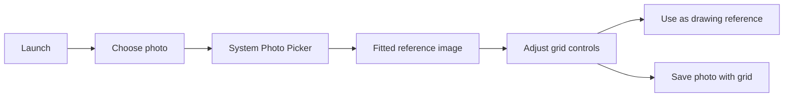

# Drawing Grid

Drawing Grid is an offline Android drawing aid. Choose a reference photo from your phone and place an adjustable, uniform grid over its visible area to transfer proportions to paper or canvas.

## MVP capabilities

- Uses Android's system Photo Picker; no broad media permission is requested.
- Keeps selected photos on the device and never modifies the original.
- Fits portrait, landscape, and square photos while preserving aspect ratio.
- Clips the grid precisely to the rendered image, including after orientation changes.
- Adjusts independent cell rows and columns (default: 4 × 4), grid visibility, color, opacity, and line thickness.
- Detects up to three perspective vanishing points locally, with manual point placement and correction.
- Draws perspective guides from a tapped image point and represents off-image points with directional edge markers.
- Pans and zooms a shared image, grid, and perspective workspace, with Fit image and Fit perspective actions.
- Saves a flattened PNG through Android's system file picker, using a name such as `photo-grid4x8.png`.
- Follows the system theme, including dark mode.



## Architecture

The app is a Kotlin, Jetpack Compose, single-activity application. `DrawingGridViewModel` owns the unidirectional UI state and persists the selected URI, grid settings, and normalized perspective points through `SavedStateHandle`. `GridGeometry` and `PerspectiveGeometry` calculate the fitted image, overlays, and shared view transform; Compose `Canvas` draws the image and overlays. Perspective detection is performed offline.

## Prerequisites

- Android Studio Ladybug or newer
- JDK 17
- Android SDK Platform 35

Build and test from the repository root:

```bash
./gradlew lint testDebugUnitTest assembleDebug
```

## Open and run

1. Open this repository in Android Studio.
2. Let Gradle sync and install any requested Android SDK components.
3. Connect an Android phone with USB debugging enabled (or start an emulator).
4. Select the `app` run configuration and click **Run**.

To build only the debug APK:

```bash
./gradlew assembleDebug
```

The APK is created at:

```text
app/build/outputs/apk/debug/app-debug.apk
```

### Sideload on a phone

Copy the APK to the phone and open it with a file manager, or use `adb install app/build/outputs/apk/debug/app-debug.apk`. Android will warn that the APK comes from an unknown source because it was not installed from Google Play. Enable installation for the file manager/browser you used only if you trust the APK, then disable that permission again if desired.

## Privacy

Drawing Grid makes no network requests and declares no internet permission. A selected photo remains local to the device; the app reads it only to display the drawing reference or to save a grid copy to a location you choose. The original is never modified.

## Current limitations

- No direct sharing of a flattened image.
- No crop or rotation controls.
- The picker grants access only as provided by Android; choose the image again if the system later revokes access.

## Roadmap

- Share exported images
- OneDrive and Google Drive sources
- Grayscale/value simplification
- Contour and edge assistance
